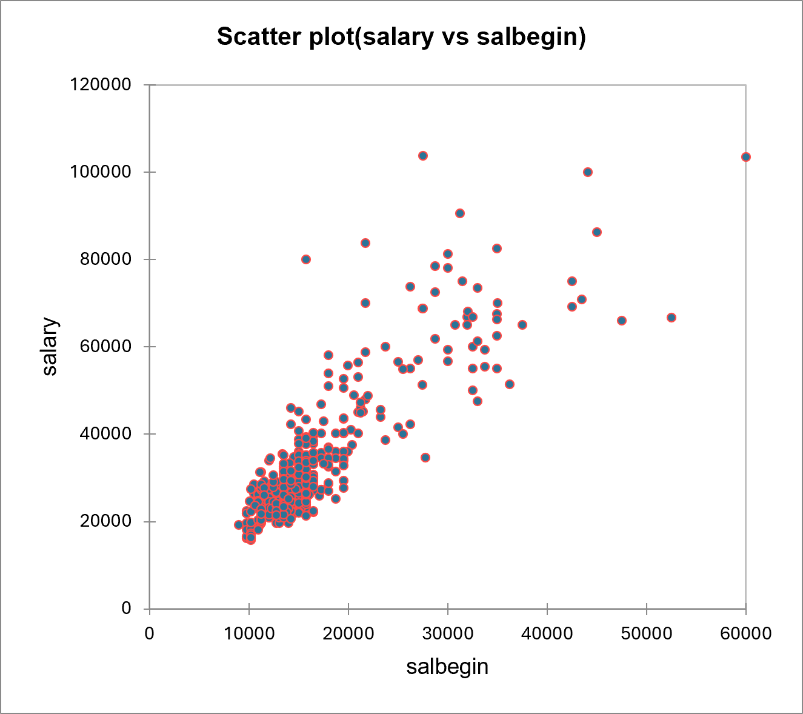

# 👔 Employee Salary Analysis

A statistical analysis project exploring salary patterns, gender pay gaps, and the effects of education, experience, and demographics on employee compensation using a real-world HR dataset.

\---

## 📋 Table of Contents

* [Overview](#overview)
* [Dataset](#dataset)
* [Key Findings](#key-findings)
* [Statistical Methods](#statistical-methods)
* [File Structure](#file-structure)
* [How to Use](#how-to-use)
* [Requirements](#requirements)

\---

## Overview

This project performs a comprehensive statistical analysis of employee salary data to uncover relationships between compensation and key variables such as gender, education level, starting salary, age, previous experience, and minority status. The analysis uses correlation tests, ANOVA, Mann–Whitney U tests, and ANCOVA to draw statistically grounded conclusions.

\---

## Dataset

The dataset (`employee\_pro.xlsm`) contains **474 employee records** with the following variables:

|Column|Description|
|-|-|
|`id`|Employee ID|
|`gender`|Gender (m / f)|
|`bdate`|Birth date|
|`educ`|Years of education|
|`jobcat`|Job category (1 = Clerical, 2 = Custodial, 3 = Manager)|
|`salary`|Current salary|
|`salbegin`|Starting salary|
|`jobtime`|Months at current job|
|`prevexp`|Previous work experience (months)|
|`minority`|Minority status (0 = No, 1 = Yes)|

\---

## Key Findings

### 📈 Salary Correlations

* **Salary \& Starting Salary**: Very strong positive correlation (*r* = 0.861, *p* < 0.0001) — employees who started higher tend to stay higher.

* **Salary \& Education**: Significant positive correlation (*r* = 0.642, *p* < .001) — more education leads to higher pay.
* **Starting Salary \& Education**: Also positively correlated (*r* = 0.625, *p* < .001).
* **Salary \& Age / Previous Experience**: Weak negative correlations (*r* = −0.168 and *r* = −0.127 respectively), both statistically significant but of limited practical effect.

&#x20;

### ⚖️ Gender Pay Gap

* A significant negative biserial correlation was found between gender and current salary (*r* = −0.445, *p* < .001), indicating **women are paid significantly less than men**.
* The same pattern holds for starting salary (*r* = −0.460, *p* < .001).
* Among **managers specifically**, the average male salary (\~63,546) was significantly higher than female managers (\~46,418) — a gap of \~17,129 units, confirmed by both ANOVA (F = 11.02, *p* = .001) and the Mann–Whitney U test (U = 471, *p* = .001).
* Gender explains approximately **19.8%** of salary variation (R² = 0.198).

### 🎓 Education \& Salary Growth

* Employees with **more than 16 years of education** experienced substantially higher salary growth (mean = 28,627.9) compared to those with 16 or fewer years (mean = 13,649.6).
* This difference is highly significant (Mann–Whitney U, *p* < 0.0001).

### 🔍 Minority Status

* A weak but statistically significant positive correlation was found between minority status and salary (*r* = 0.150, *p* = .004).

### 🧮 ANCOVA Model

* A multivariate ANCOVA model achieved **R² = 0.812**, meaning the predictors together explain \~81.2% of salary variation.
* **Age was removed** from the final model because it was non-significant (*p* = .513) and highly collinear with previous experience (*r* = 0.813). Removing it improved AIC (7247.68 → 7246.12) and RMSE (6829.31 → 6824.46) without any loss in predictive power.

\---

## Statistical Methods

|Method|Purpose|
|-|-|
|Pearson Correlation|Continuous variable relationships (salary, education, experience)|
|Point-Biserial Correlation|Relationship between salary and binary variables (gender, minority)|
|One-Way ANOVA|Mean salary differences by gender|
|Mann–Whitney U Test|Non-parametric alternative when normality is violated|
|ANCOVA|Multivariate salary prediction controlling for confounders|

\---

## File Structure

```
📦 employee-salary-analysis
 ┣ 📊 employee\_pro.xlsm   # Dataset with all variables and computed fields
 ┗ 📄 README.md           # Project documentation
```

\---

## How to Use

1. **Clone or download** this repository.
2. Open `employee\_pro.xlsm` in Microsoft Excel or a compatible tool (e.g., LibreOffice Calc).
3. The workbook includes the raw data in the `karmand` sheet, along with any computed columns (`exp\_ratio`, `total\_exp`, `salary\_growth`).
4. Statistical analyses were performed externally (e.g., SPSS, R, or Python). Refer to the findings in this README for interpretation.

\---

## Requirements

* Microsoft Excel 2016+ or LibreOffice Calc (to open `.xlsm` files)
* Optional: Xlstat for reproducing statistical analyses

\---

## 📌 Notes

* All *p*-values are two-tailed unless otherwise stated. Significance threshold: α = 0.05.

